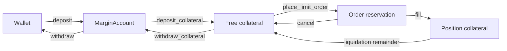

# Margin Mechanism

The linear perpetual (`contracts/perpetual`) is a leveraged CLOB instrument on
the composable instrument standard. Collateral is USDC held in a per-user
`MarginAccount`; deposits move it into the market's isolated kernel silo as free
collateral, order placement reserves initial margin from it, and fills consume
the reservation into position collateral where it stays until the position is
liquidated or the market settles.

Formulas follow
[ByBit's USDT-contract liquidation math](https://www.bybit.com/en/help-center/article/Liquidation-Price-USDT-Contract);
liquidation thresholds are documented in [liquidation.md](liquidation.md).
Fixed-point encoding ($10^6$ scale, shared with USDC base units) is in
[float_scaling.md](float_scaling.md).

## Notation

| Symbol               | Meaning                                                         |
| -------------------- | --------------------------------------------------------------- |
| $P$                  | Limit / entry price (USDC per token)                            |
| $S$                  | Order or position size (tokens)                                 |
| $L$                  | Leverage (e.g. $2$ for 2×)                                      |
| $r_m$                | Market maintenance margin rate in **percent** (e.g. $25$ → 25%) |
| $M_i$                | Initial margin (USDC)                                           |
| $M_{\mathrm{maint}}$ | Maintenance margin (USDC)                                       |

On-chain, $P$, $S$, and $L$ are stored as integers scaled by $s = 10^6$ (the
value of `units::float_scaling()`); $M_i$ and $M_{\mathrm{maint}}$ are USDC base
units at the same scale (1 USDC = $10^6$ base units).

## MarginAccount

Each trader owns a `MarginAccount` object (`nth::margin`):

1. **Create** — `margin::new` or `margin::new_with_deposit`.
2. **Fund** — `margin::deposit` moves USDC from the sender's wallet into the
   account balance; `perp::deposit_collateral` moves it on into the market's
   isolated free collateral.
3. **Trade** — `perp::place_limit_order` reserves initial margin from free
   collateral (see [Collateral flow](#collateral-flow)).
4. **Withdraw** — `perp::withdraw_collateral` returns free market collateral to
   the account, and `margin::withdraw` returns it to the wallet. Reserved and
   position collateral cannot leave through this path.

The struct deliberately lacks the `store` ability, so it cannot be wrapped or
transferred by third-party code — only `margin::keep` can place it at the
owner's address. Every mutating call checks `verify_owner` against the
transaction sender.

## Initial Margin

Initial margin is the USDC collateral required to open a leveraged order. It is
the notional divided by leverage:

$$
M_i = \frac{P \cdot S}{L}
$$

**Example:** $P = 100\,\text{USDC}$, $S = 2$ tokens, $L = 2$:

$$
M_i = \frac{100 \times 2}{2} = 100\,\text{USDC}
$$

Implemented as `perpetual::risk::initial_margin(price, size, leverage)`. The
on-chain product $P \cdot S$ is double-scaled ($s^2$); dividing by scaled
leverage cancels one factor of $s$, so the result lands directly in USDC base
units.

### Placement checks

`perp::place_limit_order` enforces, before any state change:

| Check        | Condition                          | Abort                         |
| ------------ | ---------------------------------- | ----------------------------- |
| Ownership    | Sender owns `margin_account`       | `EInvalidAccountOwner`        |
| Price / size | $P > 0$, $S > 0$                   | `EZeroPrice` / `EZeroSize`    |
| Leverage     | $0 < L \le L_{\max}$               | `EInvalidLeverage`            |
| Dust         | $M_i > 0$ after integer truncation | `EZeroMargin`                 |
| Balance      | Free collateral $\ge M_i$          | `EInsufficientFreeCollateral` |

The full $M_i$ for the submitted size moves from free collateral into an order
reservation in the same transaction.

## Maintenance Margin

Maintenance margin is the minimum collateral the protocol requires to keep a
position open. Below this level the position is liquidatable (see
[liquidation.md](liquidation.md)).

$$
M_{\mathrm{maint}} = P \cdot S \cdot \frac{r_m}{100}
$$

**Example:** $P = 100$, $S = 2$, $r_m = 25$:

$$
M_{\mathrm{maint}} = 100 \times 2 \times \frac{25}{100} = 50\,\text{USDC}
$$

Implemented as `perpetual::risk::maintenance_margin(price, size, rate)`. The
rate $r_m$ is a per-market parameter set at `perp::new` ($0 < r_m \le 100$).

## Leverage Cap

Initial margin must cover maintenance margin at entry; otherwise the position
would be liquidatable immediately. Substituting the formulas:

$$
\frac{P \cdot S}{L} \ge P \cdot S \cdot \frac{r_m}{100}
\quad\Longrightarrow\quad
L \le \frac{100}{r_m}
$$

The maximum allowed leverage is:

$$
L_{\max} = \frac{100}{r_m}
$$

For $r_m = 25$, $L_{\max} = 4$. At exactly $L_{\max}$,
$M_i = M_{\mathrm{maint}}$ (the margin buffer is zero) and the liquidation price
equals the entry price — see the boundary example in
[liquidation.md](liquidation.md).

`perpetual::risk::max_leverage` computes $L_{\max}$; `perp::place_limit_order`
rejects $L > L_{\max}$ or $L = 0$.

## Collateral Flow

### Open (place order)

1. Compute $M_i = P \cdot S / L$.
2. Reserve $M_i$ from the account's free market collateral.
3. Cross the book; rest any unfilled remainder under the reservation.

### Partial / full fill

Each fill executes at the **maker's price** and consumes margin for the fill
notional at each party's own leverage — from the reservation into position
collateral. A fully filled order's leftover reservation dust returns to free
collateral automatically.

### Cancel

`perp::cancel_order` removes a resting order by `OrderId` and releases the
entire unconsumed reservation back to free collateral — the margin that backed
already-filled size has moved to position collateral and stays there.

### Liquidation

`perp::liquidate` force-closes one under-collateralized position at a fresh mark
price: a percent penalty is carried to the keeper, and the remaining position
collateral returns to the liquidated account's free collateral. Details and
liquidation-price formulas are in [liquidation.md](liquidation.md).

## Margin Buffer and Liquidation Price

The excess collateral above maintenance defines how far price can move before
liquidation. Define the per-unit price buffer:

$$
\Delta P = \frac{M_i - M_{\mathrm{maint}}}{S}
$$

Liquidation prices (long = bid, short = ask):

$$
P_{\mathrm{liq, long}} = P_e - \Delta P
\qquad
P_{\mathrm{liq, short}} = P_e + \Delta P
$$

where $P_e$ is the position's average entry price, tracked by the perpetual
wrapper across fills. At runtime `perpetual::risk::long_liquidated` /
`short_liquidated` use the position's current collateral $M$ (which funding
settlement may have moved since entry) and compare the mark price to these
thresholds. See [liquidation.md](liquidation.md) for edge cases (margin strictly
below maintenance, max-leverage boundary, long buffer exceeding entry).

## Worked Example

Market with $r_m = 25\%$ ($L_{\max} = 4$). Trader places a 2× long:

| Step              | Values                                                    |
| ----------------- | --------------------------------------------------------- |
| Inputs            | $P = 100$, $S = 2$, $L = 2$                               |
| Initial margin    | $M_i = 100 \times 2 / 2 = 100$ USDC                       |
| Maintenance       | $M_{\mathrm{maint}} = 100 \times 2 \times 0.25 = 50$ USDC |
| Buffer            | $\Delta P = (100 - 50) / 2 = 25$ USDC per token           |
| Liquidation price | $P_{\mathrm{liq}} = 100 - 25 = 75$ USDC                   |

After 1 token fills, 50 USDC has moved into position collateral; cancelling the
remainder releases the other 50 USDC of the reservation back to free collateral.

## Implementation Map

| Concern                                                     | Module / function               |
| ----------------------------------------------------------- | ------------------------------- |
| Account custody                                             | `nth::margin` (`MarginAccount`) |
| Free / reserved / position collateral, market isolation     | `nth::collateral`               |
| $M_i$, $M_{\mathrm{maint}}$, $L_{\max}$, liquidation checks | `perpetual::risk`               |
| Place / cancel / funding / liquidation entry points         | `perpetual::perp`               |
| Matching, fill and cancel obligations                       | `nth::matching`                 |
| Typed quantities, $s = 10^6$                                | `units::*`                      |
| $r_m$, staleness bound, liquidation penalty                 | `perpetual::perp`               |

All cross-quantity arithmetic runs in `u128` inside `perpetual::risk`; no other
module multiplies prices, sizes, or leverage.
