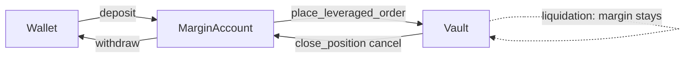

# Margin Mechanism

Strike is a leveraged perpetuals-style CLOB: every resting order is a
margin-backed position. Collateral is USDC held in a per-user `MarginAccount`;
when a trader opens a position, initial margin moves from that account into the
pool `Vault` and stays there until the position is reduced (cancel), liquidated,
or closed.

Formulas follow
[ByBit's USDT-contract liquidation math](https://www.bybit.com/en/help-center/article/Liquidation-Price-USDT-Contract);
liquidation thresholds are documented in [liquidation.md](liquidation.md).
Fixed-point encoding ($10^6$ scale, shared with USDC base units) is in
[float_scaling.md](float_scaling.md).

## Notation

| Symbol               | Meaning                                                          |
| -------------------- | ---------------------------------------------------------------- |
| $P$                  | Limit / entry price (USDC per token)                             |
| $S$                  | Order or position size (tokens)                                  |
| $L$                  | Leverage (e.g. $2$ for 2×)                                       |
| $r_m$                | Pool maintenance margin rate in **percent** (default $25$ → 25%) |
| $M_i$                | Initial margin (USDC)                                            |
| $M_{\mathrm{maint}}$ | Maintenance margin (USDC)                                        |
| $S_u$                | Unfilled size remaining on a resting order                       |

On-chain, $P$, $S$, and $L$ are stored as integers scaled by $s = 10^6$
(the value of `constants::float_scaling()`); $M_i$ and $M_{\mathrm{maint}}$
are USDC base units at the same scale (1 USDC = $10^6$ base units).

## MarginAccount

Each trader owns a `MarginAccount` object (`strike::strike`):

1. **Create** — `strike::new` or `strike::new_with_deposit`.
2. **Fund** — `strike::deposit` moves USDC from the sender's wallet into the
   account balance.
3. **Trade** — `pool::place_leveraged_order` debits initial margin from the
   account into the pool vault (see [Collateral flow](#collateral-flow)).
4. **Withdraw** — `strike::withdraw` returns free USDC to the wallet. Only
   collateral not locked in open positions is available.

The struct deliberately lacks the `store` ability, so it cannot be wrapped or
transferred by third-party code — only `strike::keep` can place it at the
owner's address. Every mutating call checks `verify_owner` against the
transaction sender.

## Initial Margin

Initial margin is the USDC collateral required to open a leveraged order. It is
the notional divided by leverage:

$$
M_i = \frac{P \cdot S}{L}
$$

**Example:** $P = 100\,\text{USDC}$, $S = 2$ tokens, $L = 2$:

$$
M_i = \frac{100 \times 2}{2} = 100\,\text{USDC}
$$

Implemented as `risk::margin_required(price, size, leverage)`. The on-chain
product $P \cdot S$ is double-scaled ($s^2$); dividing by scaled leverage
cancels one factor of $s$, so the result lands directly in USDC base units.

### Placement checks

`pool::place_leveraged_order` enforces, before any state change:

| Check        | Condition                          | Abort                                |
| ------------ | ---------------------------------- | ------------------------------------ |
| Ownership    | Sender owns `margin_account`       | `EInvalidAccountOwner`               |
| Price / size | $P > 0$, $S > 0$                   | `EInvalidPrice` / `EInvalidQuantity` |
| Leverage     | $0 < L \le L_{\max}$               | `EInvalidLeverage`                   |
| Dust         | $M_i > 0$ after integer truncation | `EZeroMargin`                        |
| Balance      | Account balance $\ge M_i$          | `EInsufficientBalance`               |

The full $M_i$ for the submitted size is withdrawn from the margin account and
deposited into the pool vault in the same transaction.

## Maintenance Margin

Maintenance margin is the minimum collateral the protocol requires to keep a
position open. Below this level the position is liquidatable (see
[liquidation.md](liquidation.md)).

$$
M_{\mathrm{maint}} = P \cdot S \cdot \frac{r_m}{100}
$$

**Example:** $P = 100$, $S = 2$, $r_m = 25$:

$$
M_{\mathrm{maint}} = 100 \times 2 \times \frac{25}{100} = 50\,\text{USDC}
$$

Implemented as `risk::maintenance_margin(price, size, maintenance_margin_rate)`.
The rate $r_m$ is a per-pool parameter set at `pool::new` ($0 < r_m \le 100$).

## Leverage Cap

Initial margin must cover maintenance margin at entry; otherwise the position
would be liquidatable immediately. Substituting the formulas:

$$
\frac{P \cdot S}{L} \ge P \cdot S \cdot \frac{r_m}{100}
\quad\Longrightarrow\quad
L \le \frac{100}{r_m}
$$

The maximum allowed leverage is:

$$
L_{\max} = \frac{100}{r_m}
$$

For $r_m = 25$, $L_{\max} = 4$. At exactly $L_{\max}$,
$M_i = M_{\mathrm{maint}}$ (the margin buffer is zero) and the liquidation price
equals the entry price — see the boundary example in
[liquidation.md](liquidation.md).

`risk::max_leverage` computes $L_{\max}$; `pool::place_leveraged_order` rejects
$L > L_{\max}$ or $L = 0$.

## Collateral Flow

### Open (place order)

1. Compute $M_i = P \cdot S / L$.
2. Withdraw $M_i$ from `MarginAccount` → deposit into pool `Vault`.
3. Build an `Order` carrying the full $M_i$, cross the book, rest any unfilled
   remainder.

Matching does **not** move margin: fills update `filled_size` only. Margin for
the filled portion remains in the vault.

### Partial / full fill

When the taker crosses resting makers, each fill emits `OrderMatched` at the
**maker's price**. The maker's `filled_size` increases; margin on that order is
unchanged. A fully filled maker is removed from the book — its margin stays in
the vault (no automatic refund on fill).

If the incoming order is fully consumed against the book, it never rests; its
full $M_i$ likewise remains in the vault.

### Cancel (close position)

`pool::close_position` cancels a resting order by `OrderId` and refunds margin
for the **unfilled** remainder only:

$$
M_{\mathrm{refund}} = \frac{P \cdot S_u}{L}
$$

where $S_u$ is `order.unfilled_size()`.

Implemented as `risk::refund_for_unfilled`. The refund moves vault → margin
account. Margin that backed filled size stays in the vault until liquidation or
a future close path.

### Liquidation

`pool::check_liquidations` sweeps resting orders against the oracle price via
`risk::is_liquidated`. Liquidated positions are removed from the book; their
margin remains in the vault. Details and liquidation-price formulas are in
[liquidation.md](liquidation.md).

## Margin Buffer and Liquidation Price

The excess collateral above maintenance defines how far price can move before
liquidation. Define the per-unit price buffer:

$$
\Delta P = \frac{M_i - M_{\mathrm{maint}}}{S}
$$

Liquidation prices (long = bid, short = ask):

$$
P_{\mathrm{liq, long}} = P_e - \Delta P
\qquad
P_{\mathrm{liq, short}} = P_e + \Delta P
$$

where $P_e$ is the position entry price. At runtime `risk::is_liquidated` uses
the order's current locked margin $M$ (equal to $M_i$ for a resting order that
has not been partially refunded) and compares the oracle price to these
thresholds. See [liquidation.md](liquidation.md) for edge cases (margin strictly
below maintenance, max-leverage boundary, long buffer exceeding entry).

## Worked Example

Pool with $r_m = 25\%$ ($L_{\max} = 4$). Trader places a 2× long:

| Step              | Values                                                    |
| ----------------- | --------------------------------------------------------- |
| Inputs            | $P = 100$, $S = 2$, $L = 2$                               |
| Initial margin    | $M_i = 100 \times 2 / 2 = 100$ USDC                       |
| Maintenance       | $M_{\mathrm{maint}} = 100 \times 2 \times 0.25 = 50$ USDC |
| Buffer            | $\Delta P = (100 - 50) / 2 = 25$ USDC per token           |
| Liquidation price | $P_{\mathrm{liq}} = 100 - 25 = 75$ USDC                   |

After 1 token fills ($S_u = 1$), cancelling the remainder refunds:

$$
M_{\mathrm{refund}} = \frac{100 \times 1}{2} = 50\,\text{USDC}
$$

The 50 USDC that backed the filled token stays in the vault.

## Implementation Map

| Concern                                                            | Module / function                  |
| ------------------------------------------------------------------ | ---------------------------------- |
| Account custody                                                    | `strike::strike` (`MarginAccount`) |
| $M_i$, $M_{\mathrm{maint}}$, $L_{\max}$, liquidation check, refund | `strike::risk`                     |
| Place / close / liquidation sweep                                  | `strike::pool`                     |
| Matching, cancel, book sweep                                       | `strike::orderbook`                |
| Vault balance                                                      | `strike::vault`                    |
| Typed quantities                                                   | `strike::units`                    |
| $s = 10^6$, default $r_m$                                          | `strike::constants`                |

All cross-quantity arithmetic runs in `u128` inside `risk.move`; no other module
multiplies prices, sizes, or leverage.
